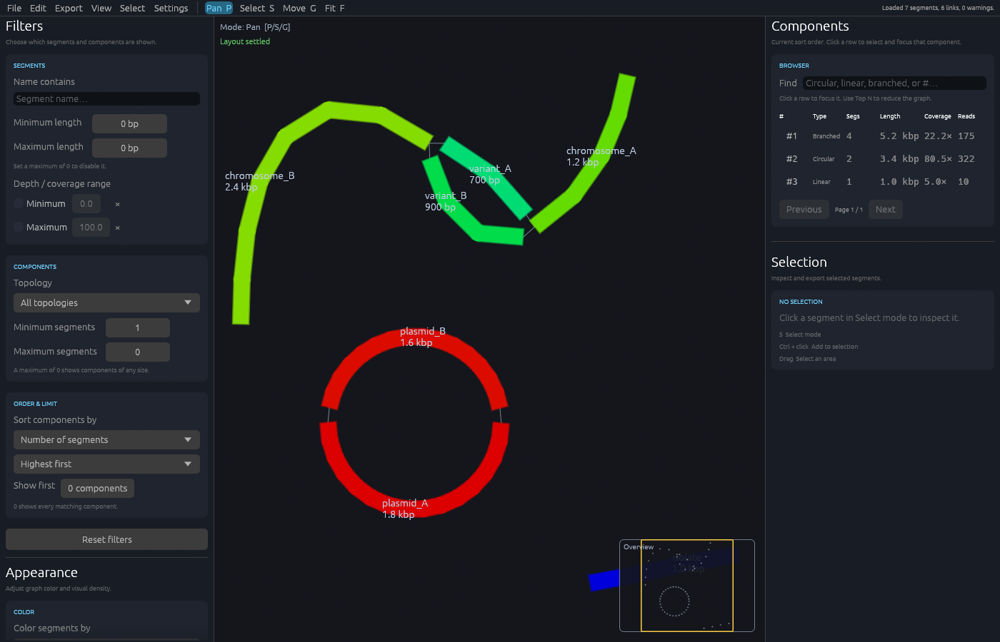

# Graphite

<p align="center">
  
</p>

Graphite is a fast desktop viewer for large assembly graphs. It is designed around memory-mapped parsing, compact graph structures, asynchronous layout and level-of-detail rendering so navigation remains practical as assemblies grow.



Graphite uses its Graphite-specific multilevel Rust implementation as the default initial-layout backend for connected, non-circular components. The bundled Bandage/OGDF FMMM implementation remains available as a reference backend for validation and benchmarking. Circular components are arranged as rings and components are packed with spacing so they do not overlap.

For settled large graphs, panning reuses cached segment bounds and edge geometry. A fitted overview draws representative dots for subpixel groups while retaining long segments and selected nodes; zooming in returns to the individual graph elements. At distant zoom levels, subpixel edges can be skipped without scanning them individually.

## Highlights

- Memory-mapped, byte-level GFA parsing that does not copy embedded sequences until needed.
- Scalable Rust multilevel layout with Barnes-Hut repulsion, plus a Bandage/OGDF reference backend for comparison.
- Asynchronous refinement, pan, zoom, rubber-band selection, and direct contig dragging.
- Circular, linear, and branched component classification.
- Filters for segment name, length, depth/coverage, topology, and minimum/maximum segments per component.
- Component sorting by length, segment count, coverage, or read count, with ascending/descending order and a top-N limit.
- A component browser with topology, segment count, total length, mean coverage, and read count. Click a row to select and focus that component.
- A minimap for navigation in large assemblies.
- Depth/coverage and read-count support from common GFA tags, including hifiasm `rd:i` tags.
- Graph colour modes for coverage, length, read count, or a uniform colour.
- Graphite, Midnight, Light, and Paper interface themes under **Settings → Theme**.
- Selectable GFA path and haplotype-walk overlays, plus internal-position containment visualization.
- SVG and PNG figure export using the selected UI theme and active GFA overlays.
- Plain or gzip-compressed GFA loading with cancellation, stage progress, and visible parser diagnostics.
- Saved sessions with verified source identity, remembered appearance, recent files, and drag-and-drop opening.
- Undo/redo for manual movement, plus background exports with configurable size and viewport cropping.

Try the synthetic [`examples/example.gfa`](examples/example.gfa), or choose **File → Open example graph…** to save and open a copy.

## GFA support

Graphite currently targets GFA1. Header version tags are parsed and genuine GFA2 input is rejected explicitly rather than being misinterpreted as GFA1.

| Record | Support |
| --- | --- |
| `H` header | Parsed, including `VN` version detection and generic optional tags |
| `S` segment | Parsed and visualized; `LN`, `DP`, `RD` and `RC` are interpreted directly |
| `L` link | Parsed and visualized; overlap CIGAR and optional tags are preserved |
| `J` jump (GFA1.2) | Parsed and visualized as a dashed graph connection; distance and `SC:i:1` are preserved |
| `P` path | Parsed into oriented path steps, including comma/link and semicolon/jump transitions |
| `W` walk (GFA1.1) | Parsed with sample, haplotype, sequence coordinates and oriented steps |
| `C` containment | Parsed and preserved, including position, orientation, CIGAR and tags |

Optional fields are stored in a generic zero-copy tag table, so standard or producer-specific tags can be retained even when Graphite does not assign them dedicated UI behavior.

`P` paths and `W` walks can be selected from the GFA overlays panel, drawn as oriented overlays on the current graph, focused in the viewport, or converted directly into a segment selection. `C` containments can be shown as dotted connectors attached at their recorded internal container position. Active overlays are preserved in interactive SVG/PNG figure exports. Containments are deliberately not converted to ordinary endpoint links because their attachment position may lie inside the container segment.

GFA2 `S/E/F/G/O/U` records are not implemented yet.

## Requirements

- Python 3.11 or newer for development, compatibility, and packaging scripts.
- Rust 1.95 or newer (required by egui/eframe). Update with `rustup update stable`.
- The default Rust-only build does **not** require the Bandage submodule or a C++ compiler.
- The optional Bandage/OGDF reference backend requires the `Bandage` submodule and a C++14 compiler.

On Debian/Ubuntu, install the native windowing libraries before building:

```bash
sudo apt install libxcb-render0-dev libxcb-shape0-dev libxcb-xfixes0-dev libxkbcommon-dev
```

## Build and run

```bash
cargo build --release
./target/release/graphite path/to/assembly.gfa
```

The file argument is optional: without it, use **File → Open GFA…**.

The file argument and drag-and-drop also accept `.gfa.gz` and `.graphite.json`
sessions. Run `graphite --version` to include the version in a bug report.

The release workflow prepares archives for Linux x86-64, Windows x86-64, and
macOS Apple Silicon, with checksums, licenses, a sample graph, and a matching
source archive. Download them from [Releases](https://github.com/CedricHermansBIT/graphite/releases)
when available; these are portable executables, not installers. Windows and macOS
packages are currently unsigned. Builds and tests for each platform run in CI;
the release draft should be reviewed and the GUI tried on each target before publication.

The Rust backend is the default and is the only backend in a normal build.

To include the Bandage/OGDF reference backend for validation or benchmarking, initialize the submodule and enable the `ogdf` feature:

```bash
git submodule update --init Bandage
cargo build --release --features ogdf
```

The resulting binary supports both selectors:

```bash
./target/release/graphite --layout-backend rust path/to/assembly.gfa
./target/release/graphite --layout-backend bandage path/to/assembly.gfa
```

Requesting `--layout-backend bandage` from a Rust-only build prints an error explaining that Graphite must be rebuilt with `--features ogdf`.

### Experimental GPU layout

On the `experiment/gpu-layout` branch, build with `--features gpu` and select
`--layout-backend gpu` to run Barnes–Hut repulsion through a `wgpu` compute
shader. The backend uses Vulkan on Linux, Metal on macOS, or Direct3D 12 on
Windows, subject to a working compute-capable adapter and driver. It does not
require an NVIDIA GPU or CUDA.

```bash
cargo build --release --features gpu
./target/release/graphite --layout-backend gpu path/to/assembly.gfa
```

This is a correctness prototype. Tree construction, attraction, and integration
still run on the CPU; each repulsion pass uploads the tree and positions, then
reads forces back. A speedup is not established. On the development H100 host,
the NVIDIA Vulkan driver currently fails during device creation. Small shader
and layout tests passed using the software Vulkan driver (`llvmpipe`).

For SSH/X11 forwarding, `--remote-ui` reduces continuous layout snapshot and repaint traffic:

```bash
./target/release/graphite --remote-ui --layout-backend rust path/to/assembly.gfa
```

To create the default Rust-only Windows release executable from Linux/WSL:

```bash
cargo xwin build --release --target x86_64-pc-windows-msvc
./target/x86_64-pc-windows-msvc/release/graphite.exe path/to/assembly.gfa
```

The optional OGDF-enabled Windows build uses:

```bash
cargo xwin build --release --features ogdf --target x86_64-pc-windows-msvc
```

For the OGDF-enabled target, `build.rs` supplies an `llvm-lib` compatibility wrapper for `cargo-xwin`, so a separately installed `llvm-lib` is not required.

The standalone source release already includes the pinned Bandage submodule
and vendored Rust dependencies, so it can build the optional backend offline.

## Benchmarking

The benchmark framework is part of the main repository under `benchmarks/`. It supports synthetic dataset generation, Graphite/Bandage/BandageNG command configuration, publication-mode serial runs, exploratory parallel runs, JSONL/CSV output, summary statistics, and SVG scaling plots.

Generate the default synthetic datasets:

```bash
python3 benchmarks/generate_synthetic.py
```

This creates the original topology-scaling suite plus dedicated 10k-segment cases for optional tags, `J` jumps, `P` paths, `W` walks, `C` containments and a mixed GFA1.2 case.

Run a serial publication benchmark:

```bash
python3 benchmarks/run_benchmarks.py benchmarks/config.local.json --mode publication
```

For development, individual tools and datasets can be selected, for example:

```bash
python3 benchmarks/run_benchmarks.py benchmarks/config.local.json \
  --mode exploratory --jobs 4 \
  --tool graphite-rust \
  --output benchmarks/results-rust
```

See `benchmarks/README.md` for the complete benchmark workflow.

For parser/layout regression testing against public third-party GFA files, Graphite also includes a compatibility corpus manifest and fetch/run harness under `tests/compatibility/`:

```bash
python3 tests/compatibility/run_compatibility.py all --tier smoke
python3 tests/compatibility/run_compatibility.py all --tier standard
```

The corpus includes commit-pinned Bandage/vg fixtures and real assembler-produced graphs from SPAdes, Flye, MEGAHIT and myloasm, with optional HPRC chr22 and current-hifiasm cases. Downloaded datasets and local SHA-256 lock/results files are gitignored. See `tests/compatibility/README.md`.


## Navigation and selection

| Action | Input |
| --- | --- |
| Pan | Middle-mouse drag, or `P` then left drag |
| Zoom | Scroll wheel or touchpad pinch |
| Select a segment | `S` then left click |
| Add to selection | `Shift` + click |
| Rubber-band select | `S` then left drag |
| Move a segment | `G` then drag it |
| Fit the graph | `F` |
| Switch modes | `P` pan, `S` select, `G` move |
| Focus a component | Click its row in the Components browser |
| Focus a path/walk | Select it in **GFA overlays**, then click **Focus** |
| Select path/walk segments | Select it in **GFA overlays**, then click **Select segments** |
| Navigate the overview | Click or drag in the minimap |
| Copy selected sequence(s) | `Ctrl+C` or **Copy sequence** |
| Undo movement | `Ctrl+Z` / `Cmd+Z` or **Edit → Undo movement** |
| Redo movement | `Ctrl+Shift+Z` / `Cmd+Shift+Z` or **Edit → Redo movement** |

`Ctrl+C` leaves ordinary text copying alone while a text field is focused. For one selected segment it copies a single FASTA record; for multiple selected segments it copies one FASTA record per segment. Segments without embedded sequence are skipped. When a `.noseq.gfa` file is loaded, sequence copy and FASTA export controls are disabled and explain why.

Mode/fit and undo shortcuts also leave text editing alone. Movement history is
limited to 20 actions and 64 MiB, and resets when a graph or filter is loaded.

## Loading, diagnostics, and sessions

Loading runs in the background and reports parsing, statistics, filtering, and
layout stages. **Cancel loading** restores the previous graph; an unsuccessful
load also keeps it available. Rust parsing, decompression, and initial layout
cooperate with cancellation. A currently executing native OGDF call cannot be
interrupted and finishes in the background after cancellation.

Empty sequence fields used by some myloasm exports are treated as missing
sequences with a warning. Malformed supported records and unresolved references appear in a diagnostics
window with line numbers. Duplicate segment names are rejected because their
references are ambiguous. **Settings → Reject graphs with parser warnings**
enables strict loading; leave it off to inspect partially valid graphs. Diagnostic
storage is bounded to 1,000 entries plus a suppression message. Producer-specific
unsupported record types are ignored. GFA2 remains unsupported.

Gzip is detected from its contents and decompressed to a temporary file, which
is then memory-mapped. It requires temporary disk space for the decompressed
input and currently permits at most 64 GiB of decompressed data.

**File → Save session…** records layout coordinates, filters, selection, overlays,
appearance and viewport. **File → Open session…** restores them without rerunning
the layout solver. Sessions reference the original GFA; they do not embed its
sequences. Keep that file at its recorded path. A SHA-256 check rejects changed
source contents; incompatible geometry or session versions are also rejected.
Sessions are limited to 512 MiB. Closing the window remembers appearance and
recent file paths separately; it does not automatically save a graph session.

## Filters, display, and components

The left sidebar controls what is visible:

- **Segments** filters names, length, and depth/coverage range.
- **Components** filters topology (**circular**, **linear**, or **branched**) and component size.
- **Order & limit** determines which components appear first and can cap the view to the first N matching components.
- **Appearance** controls colours, labels, edge opacity, scale, and coverage colour range.

The right sidebar contains the paged Components browser and selected-segment details. Selecting a component row selects every segment in it and centers the canvas on that component.

## Export

The top-level **Export** menu provides all output formats in one place:

- **Figure as SVG…** creates a scalable vector graph figure.
- **Figure as PNG…** creates a raster graph figure.
- **Selected segments as FASTA…** exports every selected segment with embedded sequence.
- **Graph statistics as CSV…** exports selected segments, or the full current graph when nothing is selected.

SVG and PNG exports use the active graph colours, UI theme background and active GFA overlays, making them suitable starting points for publication figures.

Set dimensions in the Export menu (2400 × 1600 by default), and choose whether
to export the whole filtered graph or the current viewport. Both figure formats
include labels when enabled for views with at most 2,000 segments, segment
direction indicators, and the selected segment thickness. They render the graph,
not the interface controls or selection highlight. The viewport crop preserves
aspect ratio, adding background margins if the chosen dimensions differ.

Exports run in the background from a stable snapshot and replace the destination
only after writing succeeds. The loaded source file cannot be used as an output.
Figure sizes are limited to 64–16,384 pixels per side and 64 million pixels total.
An export already in progress must finish before the application closes.

## Development and release

See [CONTRIBUTING.md](CONTRIBUTING.md) for checks and [CHANGELOG.md](CHANGELOG.md)
for changes. CI covers formatting, Clippy, tests, builds, the minimum Rust version,
the optional OGDF backend, and a small public compatibility corpus.

`python3 benchmarks/benchmark_packing.py` compares the production skyline packer
against its exhaustive reference and verifies identical placements. This measures
the packing search only, not total graph-loading performance.

`python3 scripts/package_release.py --binary target/release/graphite` prepares a
local binary archive. `python3 scripts/package_release.py --source` packages the
matching sources with vendored dependencies for `cargo build --release --locked
--offline`. The tag workflow creates a draft release with all platform archives
and the source bundle; it does not publish the draft automatically.

Graphite is licensed under [GPLv3](LICENSE). This permits reuse and commercial
distribution under its terms, including source-sharing requirements; it is not a
noncommercial license. See [THIRD_PARTY.md](THIRD_PARTY.md) for bundled code and
dependency notices.

## Project structure

```text
src/
  main.rs       application entry point and command-line argument
  app.rs        application state, interaction, panels, minimap
  gfa.rs        memory-mapped GFA parser and metadata extraction
  graph.rs      filtered graph and component summaries
  layout.rs     layout representation, backend dispatch and background refinement
  rust_layout.rs Rust multilevel/Barnes-Hut initial layout backend
  render.rs     canvas rendering, colours, hit testing
  filter.rs     filtering and sorting parameters
  selection.rs  selection and rubber-band logic
  export.rs     FASTA, CSV, SVG, and PNG export
  ui.rs         filter, display, component, stats, and selection UI
  tasks.rs      cancellable background graph preparation
  session.rs    versioned sessions and preference data
  history.rs    bounded movement undo/redo
native/
  bandage_layout.cpp  bridge to bundled Bandage OGDF layout code
Bandage/
  optional submodule: Bandage and OGDF source used only with --features ogdf
benchmarks/
  benchmark runner, synthetic datasets, summaries and plotting utilities
assets/
  graphite-icon.png  application and README icon
  graphite-icon.ico  multi-resolution Windows icon
```
